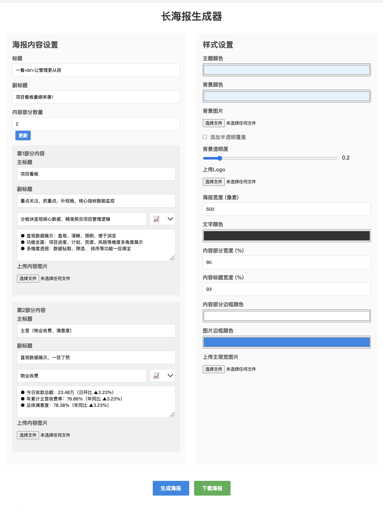

# 长海报生成器

> GitHub地址：https://github.com/seek-ER/poster-gen

一个现代美观、支持高度自定义的前端长海报生成工具，适用于产品介绍、项目报告、数据可视化等场景。

## 项目背景

在数字化运营、产品推广、数据分析等场景中，**信息可视化长海报**已成为高效传递复杂信息、提升传播力的重要工具。传统的长图设计依赖于专业设计师，修改和批量生成效率低，难以满足业务快速变化和个性化需求。

本项目旨在打造一个**纯前端、所见即所得、极易上手**的信息可视化长海报生成器，让非设计师也能轻松制作专业级长图，极大提升内容生产与传播效率。

## 开发过程

- **全程AI驱动开发**：本项目100%在 [Cursor](https://www.cursor.so/) AI编程环境下完成，99.99%代码由AI自动生成与优化，人工仅做需求描述和微调。
- **敏捷迭代**：每一轮功能、样式、交互优化均基于用户反馈，AI快速响应，极大缩短开发周期。
- **高可定制性**：支持主副标题、主视觉插画、内容区块、Logo、底标、主题色、背景色、边框、字号等全方位自定义。
- **导出一致性**：采用`html2canvas`，确保导出PNG图片与预览高度一致，满足实际业务落地需求。
- **自动化文档**：README、Wiki等文档也由AI自动生成，便于团队协作和二次开发。

## 效果展示

> 典型效果：主副标题艺术字、主视觉插画、分层内容区块、企业logo与底标、现代美观、所见即所得导出。

## 主要功能

- **主副标题自定义**：支持多行主标题、蓝色艺术字、渐变分割线、副标题加粗。
- **主视觉插画**：支持上传主视觉图片，图片与背景自然融合，支持多种背景样式。
- **内容区块灵活调整**：内容区块数量动态可调（1-6），每块支持主副标题、emoji、正文、图片上传。
- **样式高度自定义**：主题色、背景色、内容宽度、边框色、图片边框色、字号等均可实时调整。
- **Logo与底标上传**：支持右上角Logo和底部企业底标，底标自适应美观。
- **导出高清PNG**：所见即所得，导出图片与预览高度一致。
- **现代UI/UX**：整体为淡蓝色大背景，内容为白色大圆角卡片，分层清晰，呼吸感强。

## 使用方法

1. 打开`index.html`，在浏览器中访问。
2. 填写主标题、副标题、上传主视觉图片、Logo、底标等。
3. 动态调整内容区块数量，填写每块内容、上传图片、选择emoji。
4. 调整样式参数，实时预览效果。
5. 点击"生成海报"预览，满意后点击"下载海报"保存为高清PNG图片。

操作演示：

> 图1：填写内容、上传图片、实时预览

> 图2：实时预览 && 导出海报

## 技术实现

- 纯前端HTML/CSS/JavaScript，无需后端。
- 使用`html2canvas`实现所见即所得导出。
- 兼容主流浏览器，图片、艺术字、样式高度还原。
- Cussor开发交互参考聊天文件(cursor_.md)

## 适用场景

- 产品/项目介绍长图
- 数据可视化报告
- 运营/管理看板
- 会议/活动宣传

## 许可

MIT 